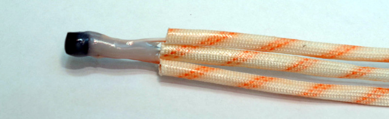

## Valden: Heat Pump Controller v1.x
<b>  The Valden Heat Pump controller is a platform to precisely control heat pumps. Controller can be easily used for newly designed heat pumps (HPs), as a repair controller or as control system for experiments with refrigeration equipment.</b>
<br><br>

## Specs
- 12V 0.5A DC power supply, 
- 230V output,
- up to 12 T sensors, -55..+125 °C range,
- 4 relays: Compressor, Hot CP or Air Fan, Cold CP or Air Fan, Crankcase Heater,
- 2 inputs: Hot and cold side refrigerant over/under pressure NC sensors,
- EEV supported, 6 pin EEV connection: 4 * coils + 2 * 12V,
- automatically turns on/of system when heating required,
- automatical power saving mode,
- built-in protections: cold start, overheat, short-term power loss, power overload, ground loop freeze and compressor protection against liquid.
- LED indication,
- control via [remote display](https://github.com/openhp/Display/) or local Serial (UART 5V),
<br><br>

## Refrigeration schemes supported
- Heat Pump (HP) with Electronic Expansion Valve (EEV),
- HP with capillary tube or TXV,
- EEV only controller.
<br><br>

## Installations supported
- Indoor: a house or technical building with a more or less stable temperature,
- Outdoor: harsh climatic conditions taken into account and tested down to minus 32°C.
<br><br>

## Changelog and history
- 2018: PCB prototype, first real installation, 
- 2019: 2-layer PCB, through-hole components, integrated buttons and display,
- 2019: controller redesigned taking into account development and operating experience,2-layer PCB, SMD
- 2019-2021: installations, development, tests, revisions, redisigns
- 06 Feb 2021: product is technically complete and ready for customers to use. Documentation and release stage.

## Get your own copy and PCB assembly
- download the PCB gerber file, [Valden_HeatPumpController_Gerber](./Valden_HeatPumpController_Gerber.zip)
- find in Google, [where to order a printed circuit board](https://www.google.com/search?q=order+pcb+gerber) (keywords: order pcb gerber), place an order,
- order electronic components, see BOM (Bill Of Materials) appendix below,
- solder electronic components. {- assembly instructions here-}

## Firmware upload
The process is the same as for others Arduinos:
- connect USB-> UART converter,
- start Arduino IDE,
- open the firmware file,
- select board and MCU in the Tools menu (hint: we are using "mini" board with 328p MCU),
- press the "Upload" button in the interface and "Reset" on the Arduino.

For arduinos with old bootloader you need to update it. (Tools-> Burn Bootloader).<br>
For successful compilation, you must have "SoftwareSerial", "OneWire" and "DallasTemperature" installed (see Tools -> Manage Libraries).<br>
As a first try it's enough to simply upload firmware without any tunings. Think of it as of commercial closed-source controller, where you cannot change internal options.

## Self-tests
QA tests are available to test the assembled board.<br>
Self-test helps you check relays, indicators, speaker and temperature sensors.<br>
To run a self-tests:
- uncomment this 3 defines in source code header,
```c
//#define SELFTEST_RELAYS_LEDS_SPEAKER    //speaker and relays QA test, uncomment to enable
//#define SELFTEST_EEV                    //EEV QA test, uncomment to enable
//#define SELFTEST_T_SENSORS              //temperature sensors QA test, uncomment to enable
```
- upload firmware,
- connect 12V power supply.<br>

Video {- demostration "How self-tests works":-}
To check EEV, you can use a stepper motor as shown in the video. If you are testing a real EEV, it should be closed after the first "beep" and partially opened after the second "beep".<br>
To check temperature sensors connectors prepare one array of sensors. Connect it to all sensors connectors one-by-one and check results in a serial console.<br>
{-Photo: PCB with connected arrays of sensors (I have enough sensors, so all 3 arrays are connected except Ts2 and Treg) -}<br>
{-Screenshot: serial console with temperature readings: -}<br>

## Wiring
Wiring is very simple despite the many connections: <br>
Phases (1st wire in electrical cables):
- connect the "power inlet" wire to one of the "phase" connectors,
- and connect the second "phase" connector to the AC input of the 12V power supply,
- connect the "Compressor" relay output to the Compressor input,
- connect the relay output "Hot CP" to the input of the Hot Circulation Pump (pump of the water floor heating system or the fan input of the indoor unit if you are using an air system),
- connect the relay output "Cold CP" to the input of the Cold Circulation Pump (ground loop pump for geothermal systems or the inlet of the outdoor unit air fan if you are using an air system),
- when using a compressor heater: connect the "Crankcase heater" output to the heater cable input (highly recommended for outdoor installation and year-round use)
Neutral (2nd cable in electrical cables),
- connect all the second wires to the "neutral" connectors on the board.

{-Photo of HV connections-}<br>

Crimp and connect low-voltage connectors:
- SCT013 sensor (the only low-voltage device in the circuit with interchangeable contacts), connect and install on the phase inlet wire,
- RS485 through a wire of the desired length to the remote control display (if used, another control method is a local computer with a USB-UART converter, you may like it for the first time). Note that A is connected to A in the display, B to B and GND to GND,
- you can power the display from a 12V controller, the board has 12V and GND secondary pins,
- EEV to EEV connector,
- T sensors to T sensors connectors,
- connect the outputs of the pressure sensors: 1st wires together to the right pin, 2nd cold side wire to the left terminal, 2nd hot side wire to the middle terminal; use the dummy when pressure sensors are not in use.

You may prefer to solder the wires over using connectors. But in this case, it will be more difficult to disassemble the system if you want to change something. The choice is yours.<br>
{-Photo: T sensors with abbreviations and full names-}<br>
{-Photo: RS485 and 12V power for display-}<br>
{-Photo: all together-}<br>
And one more: **remember about 230V inside!** Do not turn on the phase without need.<br>
Have you ever recieved 230V with your hands? If yes - you know. If no - do not try.<br>
Also, remember about animals and children, before installing permanently.<br><br>


## Sensors installation
{-Photo: power wire + SCT013-}<br>
{-Few photos: DS18B20 sensor installed -}<br>
{-Photo: pressure sensors installed -}<br>
{-Photo: pressure sensor dummy -}<br>

## Control and usage: serial console
This is a first interface to Heat Pump controller you'll see after uploading firmware (Tools->Serial Monitor).<br>
The console itself is very simple, several commands are available. Type in command, press "Send". Help and hotkeys:<br>
 <br>
Every **HUMAN_AUTOINFO** times you'll see stats. For example soon after comressor starts you'll see something like this:<br>
<br>
At this example: "hot in" ~30 °C, compressor ~80 °C and so on. Heat Pump (HP, compressor) ON, Hot water pump ON, Cold water pump ON. Power consumption 980 watts.
Abbreviations: refer to Appendix A below.<br>
Also you'll see diagnostic messages in the serial console.<br><br>

## Control and usage: [remote control display](https://github.com/openhp/Display/)

This is a way for the end user to control Heat Pump.<br>
<br><br>
End user do not wat to know much about refrigerants, evaporation, discharge temperature and so on, so this display designed as simple as possible. See [display page](https://github.com/openhp/Display/) for datails. And yes, this display is also open product with available gerber and source code.<br><br>


## Control and usage: [service display](https://github.com/openhp/ServiceDisplay/)

One day i'v realised that netbook with a serial console is very good diagnostic tool, but i want more compact tool to get maximum available information from heat pump. So this "Quickly Assembled Service Display" appeared. It fits everywhere and with a good power bank it can works 2-3 days long, without any additional power source. The diagnostic display is build from scratch, no PCB and housing here (and no plans to create it), because i do not see this device as a permanent-mounted display for the end user.<br>
<br><br>
It you want a compact and visual tool - this device is for you, so check [service display page](https://github.com/openhp/ServiceDisplay/) .<br><br>

## Starting up the heat pump system for the first time and charging refrigerant
This is not a hard part, but if you don't have experience it will take time. <br>
You have performed a pressure test and vacuumated your system. It's time to charge.<br>
Let's say you don't know how to calculate the amount of refrigerant in a newly built system:
- charge a small amount (for example 300 g) of refrigerant,
- start the heat pump,
- at this moment the suction temperature (according to the suction pressure on the pressure gauge) will be about -20 ...- 40 ° C,
- for single-component refrigerants: slightly open the valve of the HVAC gauge manifold to start adding refrigerant through the gas phase on the cold side,
- for multi-component refrigerants: turn over the refrigerant cylinder, VERY SLIGHTLY open the HVAC manifold valve to start adding a VERY LITTLE amount of refrigerant through the liquid phase,
- carry out charging until the suction temperature (according to the suction pressure on the manometer) is ~ 10 ... 15 °C lower than the temperature of the heat source (example: the temperature at the inlet of the mixture of water and antifreeze from the closed ground loop is + 8 °C, so the suction temperature should be -2 ..- 7), then close the manifold valve,
- at every step check the discharge pressure: it should not be too high compared to the temperature from the discharge sensor (Tbc) of the hot side,
- wait for the system to heat the target to a more or less stable temperature, add refrigerant while temperature increases (and suction decreases),
- stop if you are sure that the heating process is now proceeding very slowly,
- carry out the final charge when the system is stable and the heat pump stops normally (setpoint is reached), this may take 12 hours or more, and now the target difference between the suction pressure temperature and the temperature from the T sensor should be 3 ... 6 °C.

This algo is good and safe both the first time and as a starting point. As you gain experience, you will get yours much easier and faster.<br>
Also use "manual EEV mode" during charging process.<br>

## Hints 
For more information about Heat Pumps look at [Wikipedia about HP](https://en.wikipedia.org/wiki/Heat_pump).<br>
If you are interested in questions like "how refrigeration systems works" read Patrick Kotzaoglanian books.<br>
If you want more technical details, sophisticated scmemes, "how EEV can be driven by temperature" diagrams, etc. refer to vendors manuals (you can find a lot in Alfa Laval brochures, Danfoss guides, and so on).<br>
For refrigerants and oils types comparison see wiki.<br><br>

## Personal experience
Note that the SCT013 sensor and the current monitoring scheme cannot be used for accurate measurements and accurate COP calculations. Use wattmeter for accurate power measurements.<br>
Measuring the temperature of a warm floor with sensor at one point is a bad idea - it's better to deal with temperature of the "hot in" water coming from all over the floor, as implemented in firmware.<br>
The weather-dependent  (both outdoor and indoor temperature dependent) system does not work fine for 30-150 m2 buildings. The system turns out to be difficult and works bad due to unpredictable ventilation. And also due to the unpredictability of heat emitted in the house by other sources.<br>
I tried the scheme with a flooded evaporator in 2019 and found it extremely problematic, then refused to use it.<br>
Deep regeneration schemes are useful only for some refrigerants and only in certain temperature ranges. I also tried deep regeneration, I was convinced that the theory coincides with the practice and then also refused this idea.<br>
In general, it is possible by complicating the refrigeration scheme to win somewhere 1%, somewhere 3%, but all this leads to significant time and money costs, compared to not very much profit.<br>
Summary: If you want experiments - Experiment. Want reliably and quickly - make system simple.<br>
<br>
## License
GPLv3. <br><br>
This product is distributed in the hope that it will be useful,	but WITHOUT ANY WARRANTY; without even the implied warranty of MERCHANTABILITY or FITNESS FOR A PARTICULAR PURPOSE.  See the GNU General Public License for more details.<br><br>
## Author
<br>
gonzho АТ web.de (c) 2018-2021<br>

## Appendix A: Abbreviations
Abbreviations used in the documentation and firmware.<br>
Main sensors:
| Abbr. | Full name             |
| ----- | --------------------  |
| Tae   | after evaporator      | 
| Tbe   | before evaporator     |
| Tci   | cold side "input"     |
| Tco   | cold side "output"    |
| Tbc   | before condenser      |
| Tac   | after condenser       |
| Thi   | hot side "input"      |
| Tho   | hot  side "output"    |
| Tcrc  | crankcase (compressor itself)|

Additional sensor used in "swiming pool heater" or "water tank heater" schemes, check **SETPOINT_TS1** option:
| Abbr. | Full name             |
| ----- | --------------------  |
| Ts1   | additional sensor1    |

Additional sensors, disabled and not used by default:
| Abbr. | Full name             |
| ----- | --------------------  |
| Treg  | regenerator temperature|
| Ts2   | additional sensor2    |

Relays:
| Abbr. | Full name             |
| ----- | --------------------  |
| RCRCH  | crankcase heater relay	|
| RC   | cold side water pump relay	|
| RH   | cold side water pump relay    	|
| RP   | heat pump (compressor) relay	|

Other:
| Abbr. | Full name             		|
| ----- | --------------------  		|
| LSM	| LastStopCause				|
| LSC	| LastStartMessage			|
| CWP/CCP | cold side water (circulating) pump	|
| HWP/HCP | cold side water (circulating) pump	|
| EEVP	| EEV position				|
| HP	| heat pump				|

## Appendix B: Diagnostic and status messages
**LastStopCause (LSC) messages. Why system was stopped**
| Message | description |
| ------------- | ------------- |
| **Normal_stop** 	| Normal stop, i.e. setpoint sensor temperature > setpoint, so no need to heat anymore.	|
| **P.WtMax:_WATTS_**	| Protective stop. Overcurrent, double check your system, then **MAX_WATTS** and **POWERON_HIGHTIME** options. |
| **P.W.wattMIN**	| Protective stop. Power consumtion abnormally low (<max watts/5). Check your system, see **MAX_WATTS** option. |
| **P.W.TcrcMIN**	| Protective stop. "Comressor" temperature abnormally low. Check your system, see **T_WORKINGOK_CRANKCASE_MIN** option. |
| **P.Tho** 		| Protective stop. "Hot out" temperature is too high. Check your system, see **T_HOT_MAX** option. |
| **P.Thi** 		| Protective stop. "Hot in" temperature is too high. Check system, see **T_HOT_MAX** option. |
| **P.Tcrc**		| Protective stop. "Compressor" temperature is too high. Overheat protection. This is an ordinary situation during long runs. See **T_CRANKCASE_MAX** option and compressor manual if you want to tune it (~115 °C for wide-available compressors). |
| **P.Tae**		| Protective stop. "After evaporator" temperature too low. Preventing cold loop from freezing and protecting suction line from liquid. See **T_COLDREF_MIN** option. |
| **P.Tbe**		| Protective stop. "Before evaporator" temperature too low. Preventing cold loop from freezing. See **T_BEFORE_EVAP_WORK_MIN** option. |
| **P.Tbc**		| Protective stop. "Before condenser" temperatire is too high. Overheat protection. This is an ordinary situation during long runs. See **T_BEFORE_CONDENSER_MAX** option. |
| **P.Tci**		| Protective stop. "Cold in" temperature is too low. Preventing cold loop from freezing. See **T_COLD_MIN** option. |
| **P.Tco**		| Protective stop. "Cold out" temperature is too low. Preventing cold loop from freezing. see **T_COLD_MIN** option. |
| **E.Tci, E.Tco, E.Tbe, E.Tae, E.Ts1, E.Ts2, E.Tcrc, E.Treg, E.Tac, E.Tbc, E.Tho, E.Thi** |	Sensor lost, check wiring. Refer to "T sensors abbreviations". |
| **E.PresCold**	| Cold side pressure too low, check refrigerant charge and pressure sensors. |
| **E.PresHot**		| Hot side pressure too high, check refrigerant charge and pressure sensors. |

**LastStartMessage (LSM) messages. What event system is waiting for. Some informational messages.**
| Message | description |
| ------------- | ------------- |
| **StCntd:_seconds_**	| Startup countdown, short-term power loss protection. |
| **HP_Started**	| Normal start. |
| **#Thi>Setp.**	| "Hot in" temperature > setpoint, so no reason to start. |
| **#Ts1>Setp.**	| "Ts1" temperature > setpoint, so no reason to start, see **SETPOINT_TS1** option to switch betwees Thi and Ts1 as setpoint sensor. |
| **HWP_OFF**		| Setpoint sensor temperature > setpoint, so after some time (**HOTCIRCLE_STOP_AFTER** option) hot side pump powered off and gone to power saving mode. |
| **HWP_ON_by_ev**	| Hot side pump started after power saving. See **HOTCIRCLE_START_EVERY** option. |
| **#HotPrp:_seconds_**	| Hot side pump is on, waiting for T stabilisation. Countdown, seconds. See **HOTCIRCLE_CHECK_PREPARE** option. |
| **#HotSlp:_seconds_**	| Hot side pump in power save mode (sleeping). Waiting for next startup. Countdown, seconds. See **HOTCIRCLE_START_EVERY** option. |
| **#HPSlp:_seconds_**"	| Compressor: pause between starts. Countdown, seconds. **MINCYCLE_POWEROFF** option.|			
| **#CPpStart**		| Cold side pump started. |
| **#CPp:_seconds_**	| Cold side pumping. Preparing system to start compressor. Countdown, seconds. **COLDCIRCLE_PREPARE** option. |
| **#Tho>Max**		| "Hot out" temperature is too high. See **T_HOT_MAX** option. |
| **#Thi>Max**		| "Hot in" temperature is too high. , see **T_HOT_MAX** option. |
| **#CaseCold**		| Compressor crankcase temperature is too low. Can't start. This situation occurs if the outdoor installation when AC power was lost for a few hours. Wait, while the crankcase heater stabilizing your compressor temperature. See **T_CRANKCASE_MIN** option. |
| **#CaseHot**		| Compressor is still overheated, waiting. See **T_CRANKCASE_MAX** option. |
| **#Tae<RefMin**	| "After evaporator" temperature too low. Preventing cold loop from freezing and protecting suction line from liquid. See **T_COLDREF_MIN** option. |
| **#Tbe<RefMin**	| "Before evaporator" temperature too low. Preventing cold loop from freezing. See **T_COLDREF_MIN** option. |
| **#Tbc>Max**		| "Before condenser" temperatire is too high. Overheat protection. See **T_BEFORE_CONDENSER_MAX** option. |
| **#Tci<ColdMin**	| "Cold in" temperature is too low. Preventing cold loop from freezing. See **T_COLD_MIN** option. |
| **#Tco<ColdMin**	| "Cold out" temperature is too low. Preventing cold loop from freezing. See **T_COLD_MIN** option. |
| **CWP_ON_CoMin**	| Cold side pump started beause cold side temperature is too low, so preventing cold loop freeze, see **T_COLD_MIN** option. |

**Additional messages**
| Message | description |
| ------------- | ------------- |
| **OK:Pr.Cold**	| Cold side pressure restored. |
| **OK:Pr.Hot**		| Hot side pressure restored.  |
| **OK:E.T.Sens.**	| Temperature sensors restored.|
| **HWP_ON** 		| Hot side pump powered on.    |
| **Err:_errorcode_**	| Error code: 1 = temperature sensor error, 2 = Hot side pressure too high  3 = cold side pressure too low. |

##  Appendix C: secret appendix
Are you still reading? If yes, your are interested in and this appendix is for you.<br>
About sensors: do not use cheap "waterproof epoxy-covered" sensors. "Waterproof" lasts for a short time.<br>
Buy DS18B20s chips. Cheap or not cheap doesn't matter - I've never seen "bad" DSes. Solder sensors to the wires and cover the sensors with a two layers of 2-component epoxy resin as pictured below. This will work for a years.<br>
<br><br>
For sensors at compressor and discharge (+100°C and higher) use heat resistant sleeves at every wire.<br>
<br><br>
To get precise temperature readings sensors must be insulated from ambient air temperature influence with additional thermal insulation. Temperature readings from most of sensors are interesting, but +/- few degree does not matter. So most of sensors can be covered with insulation as you wish.<br>
But 2 sensors "Before evaporator" and "After evaporator" are critical to EEV and needs an extra attention. Temperature of this sensors must be as close to the temperature of copper tube  as it possible. So install Tae and Tbe sensors as pictured below. You can use thermal paste, but there is no significant difference with much more available silicone. Tape isn't shown below, for clarity, but must be used with every insulation layer.<br>
<br><br>
Overall, your system scheme with sensors positions will look like at drawing below.  Refrigerators (heat pumps) are very simple inside. The only part is not shown below is an oil filter.<br>
<br><br>
About water(glycol)<->refrigerant heat exchangers. You can use plate heat exchangers. Pros: best efficiency. Cons: costs money.<br>
<br><br>
And oxygen brazing with (20%+)silver+copper solder required here:<br>
<br><br>
You can build your own "tube-in-tube" heat exchangers. It's not hard. Cheaper. The heat exchange efficiency is worse. Very easy soldering.<br>
 <br><br>
And also you can think "I'll take old AC parts... Housing... Slightly change...  A hour or two, day of work maximum, and i'll got a refrigerant<->water heat exchanger in for a penny!" This idea is obvious. That was a first thing I've tried and do not want to try it anymore. You can also go this way, but to achieve "not very bad" performance it'll take much more than a day and much more than few $$, even if you have unlimited access to older ACs.<br>
OK, i think that's enough for this appendix, this is a controller page, and not how-to-build-refrigeration-systems page.<br>

##  Appendix D: Firmware options and fine tunings

QA tests, uncomment to enable
```c
//#define SELFTEST_RELAYS_LEDS_SPEAKER	//speaker and relays QA test, uncomment to enable
//#define SELFTEST_EEV			//EEV QA test, uncomment to enable
//#define SELFTEST_T_SENSORS		//temperature sensors QA test, uncomment to enable
```

Communication protocol with external world, choose one

```c
//#define RS485_JSON	1	//json, external systems integration
//#define RS485_HUMAN	2	//RS485 is used in the same way as the local console, warning: Use only if 2 devices (server and this controller) are connected to the same RS485 line
#define RS485_MODBUS	3	//default, Modbus via RS485, connection to the display (both sensor or 1602, see https://gitlab.com/valden/) or connection to any other MODBUS application or device 
```

System type, comment both if HP with EEV
```c
//#define	EEV_ONLY	//Valden controller as EEV controller: NO target T sensor. No relays. Oly EEV. Sensors required: Tae, Tbe, current sensor. Additional T sensors can be used but not required.
//#define	NO_EEV		//capillary tube or TXV, EEV not used
```

Which sensor is used to check setpoint, uncomment one of options
```c
#define SETPOINT_THI	//"warm floor" scheme: "hot in" (Thi) temperature used as setpoint
//#define SETPOINT_TS1	//"swimming pool" or "water tank heater" scheme: "sensor 1" (Ts1) is used as setpoint and located somewhere in water tank
```

Some more options
```c
#define HUMAN_AUTOINFO	30000	//print stats to console, every milliseconds
#define WATCHDOG		//disable for older bootloaders
```

Next sections: advanced options
Temperature sensors used in a system, comment to disable 

```c
#define T_cold_in;		//cold side (heat source) inlet sensor
#define T_cold_out;		//cold side outlet sensor
#define T_before_evaporator;	//"before" and "after evaporator" sensors are required to control EEV, both "EEV_ONLY" and "full" schemes 
#define T_after_evaporator;	//"before" and "after evaporator" sensors are required to control EEV, both "EEV_ONLY" and "full" schemes 
#ifdef SETPOINT_TS1
	#define T_sensor_1;	//T values from the additional sensor S1 are used as a "setpoint" in "pool" or "water tank heater" schemes 
#endif
//#define T_sensor_2;		//additional sensor, any source, for example: outdoor temperature, in-case temperature, and so on
#define T_crc;			//if defined: enables crankcase T sensor and crankcase heater on relay 4
//#define T_regenerator;	//an additional sensor, the regenerator temperature sensor (inlet or outlet or housing) is used only to obtain a temperature data if necessary 
#define T_afrer_condenser;	//after condenser (and before valve)
#define T_before_condenser;	//before condenser (discharge)
#define T_hot_out;		//hot side outlet
//in full scheme Hot IN required! optional in "EEV_ONLY" scheme (see "EEV_ONLY" option), 
#define T_hot_in;		//hot side inlet
```

Temperature limits
```c
#define MAGIC		0x66;	//change this value if you want to rewrite the T setpoint in EEPROM 
#define	T_SETPOINT	26.0;	//This is a predefind target temperature value (start temperature). EEPROM-saved. The value can be changed using 1. Console 2. Changing the "setpoint" on a display 3. Changing this value AND changing "magic number"
#define T_SETPOINT_MAX	48.0;	//maximum "setpoint" temperature that an ordinary user can set
#define T_SETPOINT_MIN	10.0;	//min. "setpoint" temperature that an ordinary user can set, lower values are not recommended until antifreeze fluids at hot side are used.
#define T_CRANKCASE_MIN		8.0;	//compressor (crankcase) min. temperature, HP will not start if T lower
#define T_CRANKCASE_MAX		110.0;	//compressor (crankcase) max. temperature, overheating protection, HP will stop if T higher
#define T_CRANKCASE_HEAT_THRESHOLD 16.0;//crankcase heater threshold: heater will be powered on if T lower
#define T_WORKINGOK_CRANKCASE_MIN  25.0;//compressor temperature: additional check. HP will stop if T is lower than this value after 5 minutes of work. Do not set the value too large to ensure normal operation after long pauses. 
#define T_BEFORE_CONDENSER_MAX	108.0;	//discharge MAX, system stops if discharge higher
#define T_COLDREF_MIN 		-14.0;	//suction min., HP stops if T lower, cold side (glycol) loop freeze protection and compressor protection against liquid 
#define T_BEFORE_EVAP_WORK_MIN 	-25.5;	//!!!before evaporator (after valve) min. T; can be very low for a few minutes after startup, ex: capillary tube in some conditions; and for all systems: after long shut-off, lack of reagent, 1st starts, and many others
#define T_COLD_MIN 		-15.5;	//cold side (glycol) loop freeze protection: HP stops if inlet or outlet temperature lower
#define T_HOT_MAX 		50.0;	//hot loop: HP stops if hot side inlet or outlet temperature higher than this threshold
```

Watts, cycles times (milliseconds)
```c
#define MAX_WATTS	1000.0 + 70.0 + 80.0	//power limit, watt, HP stops in case of exceeding, example: compressor: ~1000 + hot CP 70 + cold CP 80
#define POWERON_PAUSE     	300000    //after power on: 			wait 5 minutes  before the start of HP (protected from power faults) 
#define MINCYCLE_POWEROFF 	600000    //after a normal compressor stop: 	10 minutes pause 	(max 99999 seconds) 
#define MINCYCLE_POWERON  	3600000  //after compressor start: 		minimum compressor operation time, i.e. work time is not less than this value (or more, depending on the setpoint temperature) 60 minutes = 3.6 KK 120mins = 5.4 kK.
#define POWERON_HIGHTIME	7000	//after compressor start: 		defines time when power consumption can be 3 times greater than normal, 7 sec. by default
#define COLDCIRCLE_PREPARE	90000	//before compressor start:		power on cold CP and wait 90 sec; if false start: CP will off twise this time; and (hotcircle_stop_after - this_value) must be > hotcircle_check_prepare or HP will go sleep cycle instead of start
#define DEFFERED_STOP_HOTCIRCLE	1200000	//after compressor stop:		wait 20 minutes, if no need to start compressor: stop hot WP; value must be > 0
#define HOTCIRCLE_START_EVERY	2400000	//while pauses:				pump on "hot side"  starts every 40 minutes (by default) (max 9999 seconds) to circulate water and get exact temperature reading , option used if "warm floor" installation (Thi as setpoint)...
#define HOTCIRCLE_CHECK_PREPARE	300000	//while pauses:				...and wait temperature stabilisation 5 minutes (by default), after that do setpoint checks...
#define HOTCIRCLE_STOP_AFTER	(HOTCIRCLE_CHECK_PREPARE + COLDCIRCLE_PREPARE + 30000)		//...and then stop after few minutes of circulating, if temperature is high and no need to start compressor; value must be check_prepare + coldcircle_prepare + 30 seconds (or more)
```

EEV options
If you are using capillary tube or TXV: simply skip next section
Depending on how many milliseconds are allocated per step, the speed of automatic tuning will change.
Remember that you'll see refrigeration system reaction on every step not immediately, but after few minutes, sometimes after tens of minutes.
```c
#define EEV_MAXPULSES		250	//max steps, 250 is tested for sanhua 1.3

//steps tuning: mulliseconds per fast and slow (precise) steps
#define EEV_PULSE_FCLOSE_MILLIS	20	//(20 tube evaporator)		fast closing, closing on danger				(milliseconds per step)
#define EEV_PULSE_CLOSE_MILLIS	60000	//(50000 tube evaporator)	accurate closing while the compressor works 		(milliseconds per step)
#define EEV_PULSE_WOPEN_MILLIS	20	//(20 tube evaporator)		standby (waiting) pos. set				(milliseconds per step)
#define EEV_PULSE_FOPEN_MILLIS	1400	//(1300 tube evaporator)	fast opening, fast search 				(milliseconds per step)
#define EEV_PULSE_OPEN_MILLIS	70000	//(60000 tube evaporator)	accurate opening while the compressor works		(milliseconds per step)
#define EEV_STOP_HOLD		500	//0.1..1sec for Sanhua		hold time						(milliseconds per step)
#define EEV_CLOSEEVERY		86400000	//86400000: EEV will be closed (zero calibration) every 24 hours, executed while HP is NOT working	(milliseconds per cycle)

//positions
#define EEV_CLOSE_ADD_PULSES	8	//read below, additional steps after zero position while full closing 
#define EEV_OPEN_AFTER_CLOSE	45	//0 - set the zero position, then add EEV_CLOSE_ADD_PULSES (zero insurance, read EEV guides for this value) and stop, EEV will be in zero position. 
					//N - set the zero position, than add EEV_CLOSE_ADD_PULSES, than open EEV on EEV_OPEN_AFTER_CLOSE pulses
					//i.e. it's a "waiting position" while HP not working, value must be <= MINWORKPOS
#define EEV_MINWORKPOS		50	//position will be not less during normal work, open EEV to this position after compressor start

//temperatures
#define EEV_PRECISE_START	7.0	//(8.6 tube evaporator) 	precise tuning threshold: 		make slower pulses if (real_diff-target_diff) less than this value. Used for fine auto-tuning
#define EEV_EMERG_DIFF		1.7	//(2.5 tube evaporator) 	liquid at suction threshold:		if dangerous condition occured:  real_diff =< (target_diff - EEV_EMERG_DIFF)  then EEV will be closed to min. work position //Ex: EEV_EMERG_DIFF = 2.0, target diff 5.0, if real_diff =< (5.0 - 2.0) then EEV will be closed to EEV_MINWORKPOS
#define EEV_HYSTERESIS		0.5	//(0.6 tube evaporator) 	hysteresis, to stop fine tuning:	must be less than EEV_PRECISE_START, ex: target difference = 4.0, hysteresis = 0.3, no EEV pulses will be done while real difference in range 4.0..4.3 
#define EEV_TARGET_TEMP_DIFF	3.6	//(3.6 tube evaporator) 	target difference between Before Evaporator and After Evaporator, the head of whole algorithm

//additional options
#define EEV_REOPENLAST		1	//1 = reopen to last position on compressor start, useful for ordinary schemes with everyday working cycles, 0 = not
#define EEV_REOPENMINTIME	40000	//after system start: min. delay between "min. work pos." (must be > 0 in this case and > waiting position) set and reopening start
//#define EEV_MANUAL			//comment to disable, manual set of EEV position via console; warning: this option will stop all EEV auto-activities, including zero position find procedure; so this option not recommended: switching auto/manual mode from console after startup is a better way

//do not use next option untill you're not really need it
//#define EEV_DEBUG				//debug, usefull during system fine tuning, works both with local serial and RS485_HUMAN
```

Communication addresses
```c
const char devID  = 0x45;	//used only if JSON communication, does not matter for modbus and Valden display https://github.com/OpenHP/
const char hostID = 0x30;	//used only if JSON communication, not used for modbus
```

Last option
```c
#define MAX_SEQUENTIAL_ERRORS 	15 		//max cycles to wait auto-clean error, ex: T sensor appears, stop compressor after counter exceeded (millis_cycle * MAX_SEQUENTIAL_ERRORS)
```
## Appendix D: bill of materials
| Part | Quantity |
| ------------- | ------------- |
| **1206 Resistors:**	||
| 10	| 1	|
| 100	| 1	|
| 120	| 1	|
| 1K	| 7	|
| 10K	| 6	|
| 100K	| 2	|
| 22	| 1	|
| 2.2K	| 4	|
| 470	| 10	|
| **1206 Caps:**	||
| 0.01uF	| 2	|
| 0.1uF		| 4	|
| 1uF		| 8	|
| 10uF		| 5	|
| **1206 LEDs:**	||
| Red (error LEDs)	| 2	|
| Green (OK LED)	| 1	|
| Yellow 		| 11	|
| **SOP(SOIC) ICs:**	|	|
| ADM2587EBRWZ (SOIC-20)	| 1	|
| 74HC4067D (SOIC-24)		| 1	|
| 74HC595D (SOP-16)		| 3	|
| ULN2003A_(SOP-16)		| 2	|
| 817S (SOP-4)			| 2	|
| **XH2.54 Headers + Plugs:**	|	|
| XH2.54-6P header + 6P plug	| 4	|
| XH2.54-3P header + 3P plugs	| 2	|
| XH2.54-2P header + 2P Plugs	| 1	|
| XH2.54 Crimp terminal		| 40	|
| **Power terminals:**		|	|
| 6.35 Blade terminal (726386-2 or same)		| 16	|
| 6.35 Quick disconnect crimp terminal insulated	| 16	|
| **Others:**	|				|	
| 10nF HV-9.0x3.0 (blue disc 2kV HV cap)	| 1	|
| 22uf_16v D5.0xF2.0 (electrolytic cap)		| 1	|
| Resistor Network\*4 DIP-1X5P-2.54 (3..5K)	| 3	|
| MMBT2222A (SOT-23-3)				| 1	|
| LM7805 (TO-220)				| 1	|
| SMIH-12VDC-SL-C				| 4	|
| BUZZER-R9.0-2P-4.0				| 1	|
| ARDUINO PRO MINI				| 1	|
| Power supply, 12v1.25A 70x30x40 (or any 0.5A+)| 1	|
| DS18B20					| 12	|
| usb→uart (to upload firmware)			| 1	|
| Current sensor sct-013-000			| 1	|

## Author
<br>
gonzho АТ web.de (c) 2018-2021<br>
